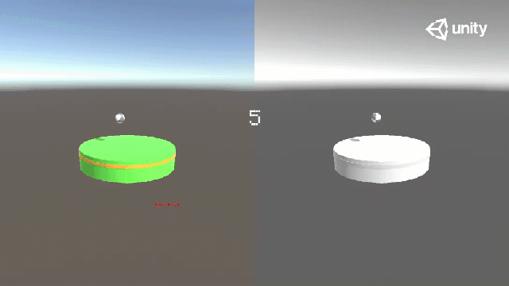
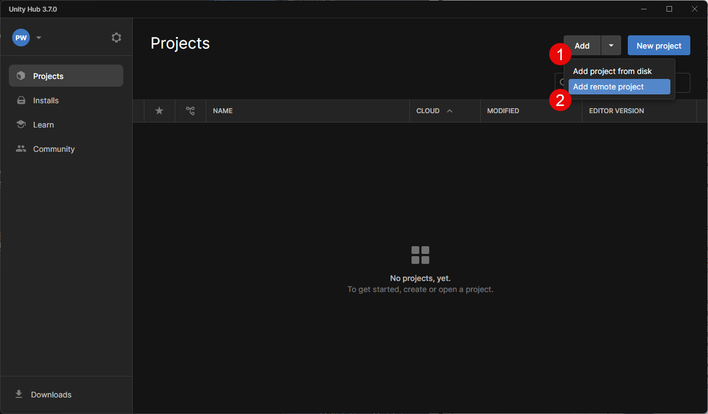

# Supporting Task Switching with Reinforcement Learning
Attention management systems aim to mitigate the negative effects of multitasking. However, sophisticated real-time attention management is yet to be developed. We present a novel concept for attention management with reinforcement learning that automatically switches tasks. The system was trained with a user model based on principles of computational rationality. Due to this user model, the system derives a policy that schedules task switches by considering human constraints such as visual limitations and reaction times. We evaluated its capabilities in a challenging dual-task balancing game. Our results confirm our main hypothesis that an attention management system based on reinforcement learning can significantly improve human performance, compared to humans’ self-determined interruption strategy. The system raised the frequency and difficulty of task switches compared to the users while still yielding a lower subjective workload. We conclude by arguing that the concept can be applied to a great variety of multitasking settings.


## Features
This repository contains the implementation of the CHI 24 paper "Supporting Task Switching with Reinforcement Learning" along with all the utilized RL models and algorithms. We call for using, extending, and improving the tool for researching and designing future attention management systems. The project is structured in a way to easily extend the current version with new custom tasks and provide therefore a tool to research the usage of RL AMS in virtual Unity environments. 


## Demo



## Citation
Please cite our paper as:

```
@article{lingler2024taskswitching,
  title={Supporting Task Switching with Reinforcement Learning},
  author={Lingler, Talypova, Jokinen, Oulasvirta, Wintersberger},
  booktitle={Proceedings of the 2024 CHI Conference on Human Factors in Computing Systems},
  pages={1--18},
  year={2024},
  publisher = {ACM},
  doi = {https://doi.org/10.1145/3613904.3642063}
}
```
You can access the paper [HERE](docs/CHI24_Supporting_Task_Switching_with_Reinforcement_Learning.pdf). The CHI'24 presentation is available [HERE](https://youtu.be/UiRJQ6dzI_g).

## Getting Started
This section describes how you get the tool running on your local machine. Therefore, Unity and a Anaconda environment including the ML-Agents toolkit must be installed.


### Prerequisites
The Project uses Anaconda for open source python distribution. Goto https://www.anaconda.com/ for the installation. Unity can be downloaded at https://unity.com/download. Follow the instructions to install the Unity Hub and choose Unity editor version 2022.3.12f1.


### Installation
```
git clone https://github.com/reapphil/AITentiveMultitasking.git
```

The project includes an Anaconda environment setup file describing the necessary libraries and their dependencies. Change the directory to the cloned repository and run the following command to create the virtual environment:

```
conda env create -f configs/env_setup.yml
```

The environment can be activated by the following command:

```
conda activate aui
```

The installation of the ML-Agents toolkit is still missing. First open the project in the Unity Hub by clicking _Add_ and _Add project from disk_ and select the directory of the cloned repository:


 Now choose the _AITentiveMultitasking_ project in the projects list. The project opens. Goto https://github.com/Unity-Technologies/ml-agents/blob/release_19_docs/docs/Installation.md#install-the-comunityml-agents-unity-package for the installation of ML-Agents and follow the instructions in section _Install the com.unity.ml-agents Unity package_.


## Next Steps
1. For an overview of the project and how you can configure and run the environment, checkout the [AITentive Project Overview](docs/AITentive-Project-Overview.md) page.
2. For adding a new custom task into the environment that can be directly handled by the supervisor, check out the [Adding a Custom Task](docs/Adding-a-Custom-Task.md) page.
3. For a description how to train and evaluate an environment, checkout the [Model Training and Evaluation](docs/Model-Training-and-Evaluation.md) page.
4. For the results of the user study and how to reproduce them, checkout the [User Study: Results and Setup](docs/User-Study-Results-and-Setup.md) page.


## Authors
* Alexander Lingler
* Dinara Talypova
* Jussi P.P. Jokinen
* Antti Oulasvirta
* Philipp Wintersberger


## Acknowledgments
This project is supported by the Austrian Science Fund (FWF) under grant Nr.P35976-N (AITentive) and the Research Council of Finland under grant Nrs. 328400, 341763, and 328813.
