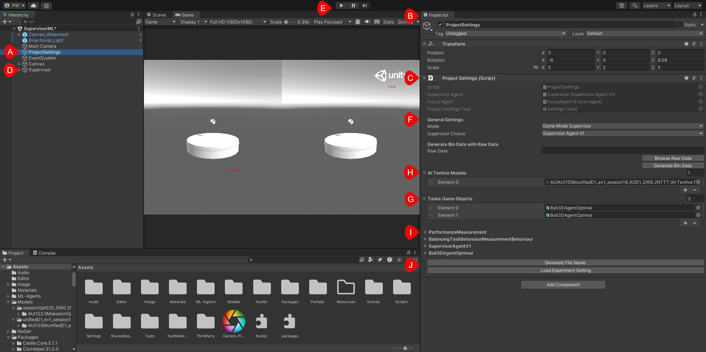
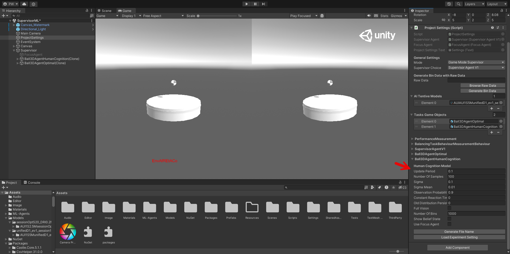

# Project Settings

    

The project consists of many game objects (**A**) containing 3D objects and attached scripts (called components) defining their behavior. The values of the game objects respectively their scripts can be changed in the inspector view (**B**). To simplify the configuration of the RL environment, the project contains a central game object that is responsible for managing the configurations of the involved game objects using reflection called _ProjectSettings_ (**C**). The changed values are directly propagated to their respective components. For instance by changing the Supervisor Choice from _Supervisor Agent V1_ to _Supervisor Agent Random_ the corresponding scripts are enabled/disabled in the supervisor game object (**D**). After changing the configuration, the environment can be started by pressing the play button (**E**).

## Configuration Elements
- **(F)** General Settings
  - Mode - Conditions used during the user study.
    - Game Mode Supervisor - The switches are carried out by the defined supervisor model (H).
    - Game Mode No Supervisor - The user has to decide by themself when to switch (e.g. by pressing the shoulder buttons when using a game-pad or by pressing the tabulator button using a keyboard).
    - Game Mode Notification - The switches are indicated by the defined supervisor model but must be confirmed by the user.
    - Default Mode - Is used during the training and evaluation and allows to also specify a task agent (H) solving the task.
  - Supervisor Choice - Defines what kind of supervisor should be used.
    - Supervisor Agent - Latest supervisor script allowing to add new custom tasks (generic implementation).
    - Supervisor Agent V1 - Legacy supervisor script that was used during the user study with a tight coupling to the balancing task. Therefore, it does not work if any other task than the balancing task is added and only remains in the project to run the legacy models of the user study.
    - Supervisor Agent Random - Supervisor that works without any model and randomly switches between the tasks. Was e.g. used for the evaluation of the cognitive models.
- **(G)** Task Game Objects - Define the tasks of the environment. The tasks can be changed here and they are instantly loaded into the environment (e.g. by adding a third chess soling puzzle):

    

- **(H)** AITentive Models - Defines the model to use based on a _AITentiveModel_ scriptable object that not only contains the model but also the corresponding agent class (see [Model Training and Evaluation](Model-Training-and-Evaluation.md) for more details). The project automatically assigns the model to the right agent script. This list could contain a supervisor model, the task models (e.g. for evaluation or training purpose of the supervisor) or a focus model.
- **(I)** Component Details - This section shows several drop down menus to configure the parameters of the involved game objects. Hover over the different variables of the components to see their description. The displayed dropdowns reflect the elements of the environment. For instance, after changing one _Ball3DAgentOptimal_ to _Ball3DAgentHumanCognition_, the dropdown menus update to the new selection which then can be adapted to the needs of the experiment:

    

- **(J)** Load Experiment Settings - Allows to load settings with the help of a _JSON_ file. You can find some experiment settings under `config/experiment_config`. For instance, this directory contains the used settings for the 4 different conditions of the user study of the paper (e.g. `config/experiment_confi/experiment_kw26_supervisorConstraints.json`).

## Next Steps
Now you know how you can configure the existing implementation. Page [Adding a Custom Task](Adding-a-Custom-Task.md) explains how you can add an own task and defines the interfaces which must be implemented so that the supervisor can manage your task. Furthermore, this page describes how the _ProjectSettings_ game object can automatically detect and display the variables of the tasks involved based on a custom attribute.
You could adapt the settings (e.g. by adding more tasks) and conduct your own experiment. To do so, you need a new supervisor model which can deal with more than two tasks. Page [Model Training and Evaluation](Model-Training-and-Evaluation.md) describes how you can train and evaluate a new model with the help of the building pipelines included into this project.
You could also try to reproduce the results of our user study with the help of the provided experiment settings. For more details see [User Study: Results and Setup](User-Study-Results-and-Setup.md).