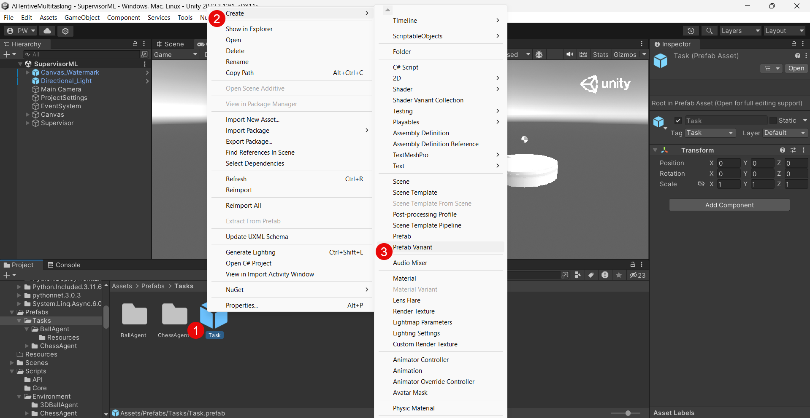

# Adding a Custom Task
The following steps must be performed to add a task to the AITentive environment:
1. Create a prefab variant of the Task prefab consisting of the 3D objects, scripts and other components defining your task.
2. Adding an agents script defining the Markov decision process of your environment. This script must implement either the ITask or the ICrTask interface so that the supervisor can deal with the task.
3. Adding a setting definition to configure your environment for the training and evaluation with a _JSON_ file (optional).
4. Adding a behavioral measurement component to evaluate your CR model (optional).


## Creation of Task Prefab Variant
<p align="center">
    
</p>

Tasks are defined as [prefabs](https://docs.unity3d.com/Manual/Prefabs.html) which are reusable asset container acting as templates. This prefabs can then be instantiated and therefore be added into the open scene. It is possible to define variants of a base prefab by adding or removing certain elements. Adjustments made to the base prefab are uniformly applied to its variants as well.
The project contains a base prefab under `Assets/Prefabs/Tasks` defining the building blocks of a task. Therefore every task must be a variant of this _Task_ prefab. To create a variant right click onto the _Task_ prefab (**1**) navigate to _Create_ (**2**) and click on _Prefab Variant_ (**3**). Now create a new directory named after your task. The task directory must include a further directory called `Resources` such that the prefab can be found by Unity. Copy your prefab variant into this directory.
The _Task_ prefab consists of the following parts:
* Camera - Including a predefined position that can be adapted and a postprocessing layer that allows the supervisor to display the currently inactive task in black and white and the ability to indicate a notification by coloring the target task white. Furthermore the camera contains a child called `Eye_Canvas`that will be enabled and disabled indicating if the focus agent currently focus the specific task.
* Agent - Empty game object that should contain the agent as well as the behavior parameters script.
* Spawn Container - Potential spawned objects should be placed as a child of this empty game object to keep the project clear.


## Interface implementation
There are two interfaces that might be implemented by the agent script:
* `ITask` - Agent that solves the task without any human constraints.
* `ICrTask` - Agent that solves the task applying principles of computational rationality.


### ITask
This interface specifies properties and methods for the communication between the task and the supervisor. The supervisor can either set the task active (`IsActive = true`) or inactive (`IsActive = false`). The other way around the task provides its current observed state to the supervisor (`void AddObservationsToSensor(VectorSensor sensor)`). The sum over all states of the tasks define the current state of the supervisor. For more details see the description provided inside of the interface.


### ICrTask
This interface specifies properties and methods for the communication between the CR task and the focus agent. The focus agent can either set the task to be focused (`IsFocused = true`) or not to be focused (`IsFocused = false`). In case the CR model uses a focus agent, the belief state should updated accordingly. The other way around the task provides its current perceived belief state to the focus agent (`void AddPerceivedObservationsToSensor(VectorSensor sensor)`). The sum over all belief states of the tasks define the current state of the focus agent. For more details see the description provided inside of the interface.


## ProjectAssign Attribute
As discussed in [AITentive Project Overview](AITentive-Project-Overview.md) the tasks and their respective variables are shown in the `ProjectSettings` inspector in case the `ProjectAssign` attribute is set for the needed variables. You can also specify headers to structure the appearance in the dropdown view. After specifying the attribute, changes are directly propagated to the respective fields. Furthermore the defined `tooltip` is also shown in the `ProjectSettings` inspector if you hover over the specific field.


## Settings Definition (Optional)
In case you want to configure the environment for the training or evaluation without the need for manually changing the specific values before the training/evaluation, you can define your own settings for your different components in the _Settings_ class. Furthermore you must adapt the ProjectSettingsMapper and the SceneManagement class (function `AssignProjectSettings`) to handover your configuration. After you have added your changes, you can specify your configuration inside a _JSON_ file and use it when calling the training or evaluation pipeline (for more details see [Model Training and Evaluation](Model-Training-and-Evaluation.md)).
Example of _JSON_ parameters for the CR model of the experiment:

```
{
	
    ...

	"ball3DAgentHumanCognitionSettings": {
		"numberOfBins": 1000,
		"showBeliefState": false,
		"numberOfSamples": 1000,
		"sigma": 0.01,
		"sigmaMean": 0.2,
		"updatePeriode": 0.4,
		"observationProbability": 0.1,
		"constantReactionTime": 0,
		"oldDistributionPersistenceTime": 0.4,
		"fullVision": false
	}
}
```


## Behavioral Measurement (Optional)
Currently the behavioral measurement is still strongly coupled to the balancing task used in the CHI paper and is part of the supervisor and not the task itself. This will be adapted in the next mayor update by building a more generic approach and defining a protocol how to integrate a behavioral measurement component per task. This is a must have since the measurement is needed to evaluate your potential CR model by comparing the behavior of the agent with humans.


## Next Step
Once you've integrated your task agent, the next step is to train and assess both, your agent and the supervisor, based on your agent's behavior. Detailed instructions on utilizing the existing building pipelines for this purpose can be found on the [Model Training and Evaluation](Model-Training-and-Evaluation.md) page.
