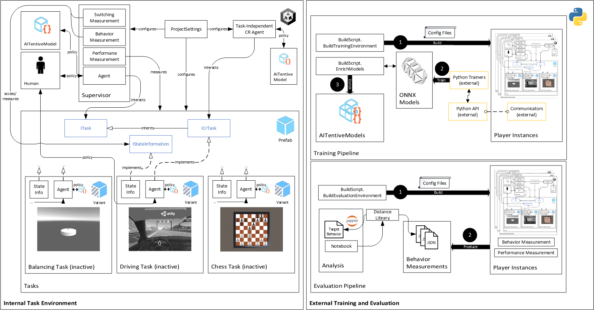

# Adding a Custom Task
The following steps must be performed to add a task to the AITentive environment:
1. Create a prefab variant of the Task prefab consisting of the 3D objects, scripts and other components defining your task.
2. Add an agent script to define the Markov decision process (MDP) for your environment. This script should implement either the ITask or ICrTask interface, ensuring compatibility with the supervisor for task management.
3. Implementing the IStateInformation interface to evaluate your CR model (optional).

## Architecture

    

The Figure shows the internal task environment's architecture. Tasks extend a prefab including mandatory components like a camera and an _ITask_ interface for AMS agent interaction. The already implemented AMS of the toolkit controls the currently active task, indicated by a colored output, while inactive tasks are in black and white. The controlling entity uses an agent script from the _ML-Agents_ framework, operating with either a learned model or user input. The _ICrTask_ interface defines methods for any agent within the CR environment (e.g., a vision agent). Tasks and components are configured through _ProjectSettings_, either directly in Unity or via configuration files.

The toolkit includes measurement features to estimate performance, switching behavior, and task behavior. Performance, defined by the AMS's reward function, is task-independent. Switching and task behavior measurements are task-dependent but standardized. The _IStateInformation_ defines the state space per task, while the _Behavior Measurement_ component records average actions in a discretized space for comparison. Reaction time uses discretization based on source and target tasks. Switching behavior is recorded per task combination, capturing the state space and actions at switching moments.

The toolkit also provides pipelines to train and evaluate the involved agents. The training and evaluation pipelines create player instances based on provided configuration files. For training, these instances use the _ML-Agents_ framework, allowing concurrent training across multiple instances, or external algorithms can be used. The evaluation environment tests different models against targets, like human behavior. Once set up, the pipeline executes evaluations, measuring objectives (e.g., reaction times, average actions) for a predefined number of actions. This data determines the distance between model and target behavior using the toolkit's distance library.

## Creation of Task Prefab Variant

    

Tasks are defined as [prefabs](https://docs.unity3d.com/Manual/Prefabs.html) which are reusable asset container acting as templates. This prefabs can then be instantiated and therefore be added into the open scene. It is possible to define variants of a base prefab by adding or removing certain elements. Adjustments made to the base prefab are uniformly applied to its variants as well.
The project contains a base prefab under `Assets/Prefabs/Tasks` defining the building blocks of a task. Therefore every task must be a variant of this _Task_ prefab. To create a variant right click onto the _Task_ prefab (**1**) navigate to _Create_ (**2**) and click on _Prefab Variant_ (**3**). Now create a new directory named after your task. The task directory must include a further directory called `Resources` such that the prefab can be found by Unity. Copy your prefab variant into this directory.
The _Task_ prefab consists of the following parts:
* Camera - Including a predefined position that can be adapted and a postprocessing layer that allows the supervisor to display the currently inactive task in black and white and the ability to indicate a notification by coloring the target task white. Furthermore the camera contains a child called `Eye_Canvas`that will be enabled and disabled indicating if the focus agent currently focus the specific task.
* Agent - Empty game object that should contain the agent as well as the behavior parameters script.
* Spawn Container - Potential spawned objects should be placed as a child of this empty game object to keep the project clear.

## Interface implementation
There are two interfaces that might be implemented by the agent script:
* `ITask` - Agent that solves the task without any human constraints.
* `ICrTask` - Agent that solves the task applying principles of computational rationality.

### ITask
This interface specifies properties and methods for the communication between the task and the AMS/supervisor. The supervisor can either set the task active (`IsActive = true`) or inactive (`IsActive = false`). The other way around the task provides its current observed state to the supervisor (`AddTrueObservationsToSensor(VectorSensor sensor)`). The sum over all states of the tasks define the current state of the supervisor. In combination with the task specific reward signal (provided via the `TaskRewardForSupervisorAgent` queue) the AMS can learn a policy support human switching between tasks. For more details see the description provided inside of the interface.

### ICrTask
This interface defines the properties and methods for communication between a CR task and the vision/focus agent using the EMMA model for vision encoding. The task must supply a `FocusStateSpace` object, which includes all Areas of Interest (AOIs) the vision agent can focus on, defining the action space. To represent the task's current state, it implements the method `AddBeliefObservationsToSensor(VectorSensor sensor)`, which provides necessary observations to the focus agent. Together with the task-specific reward signal, sent via the `TaskRewardForFocusAgent` queue, the vision agent can learn a policy for focusing on relevant AOIs. This focus can then be used to update the belief state of the CR-task accordingly. For more details, consult the interface documentation.

### Reward Signal Aggregation
A reward function, expressed as a string, can be provided to both the focus and supervisor agents as a parameter. This allows testing different reward signals during training without modifying the code. The notation `r_{number}` represents the values returned by the `TaskRewardForSupervisorAgent` or `TaskRewardForFocusAgent` queue for specific tasks, with `{number}` starting at 0 and corresponding to tasks arranged from left to right. All functions from the Math library are available (without the Math. prefix). Additionally, the following variables are available for use: `t_s` (time since the last switch) and `t_d` (decision request interval in seconds).

## ProjectAssign Attribute
As discussed in [AITentive Project Overview](AITentive-Project-Overview.md) the tasks and their respective variables are shown in the `ProjectSettings` inspector in case the `ProjectAssign` attribute is set for the needed variables. You can also specify headers to structure the appearance in the dropdown view. After specifying the attribute, changes are directly propagated to the respective fields. Furthermore the defined `tooltip` is also shown in the `ProjectSettings` inspector if you hover over the specific field.

## State Discretization for Belief State Encoding
The Unity job system, in combination with the Burst compiler, enables runtime updates of belief states without pre-calculating state transition probabilities. The toolkit offers classes for updating the probability of an object being at a specific position in 1D (e.g., along an axis, as seen in `ObjectIn1DLocationProbabilitiesUpdateJob`) and in 2D (e.g., within a grid or rectangle, using `ObjectIn2DGridProbabilitiesUpdateJob` or `ObjectIn2DRectangleLocationProbabilitiesUpdateJob`). For example, the ball location probabilities in our CHI paper ["Supporting Task Switching with Reinforcement Learning"](https://dl.acm.org/doi/10.1145/3613904.3642063) were computed using these classes.

## Behavioral Measurement
The toolkit provides a standardized method for measuring human performance and reaction times. Its behavior measurement module stores the average performed actions and reaction times for each discretized state. The interface `IStateInformation` must be implemented to define this discretization process. The variables controlling the discretization should be marked with the `ProjectAssign` attribute, making them configurable through both the editor (see point “L” in the [AITentive Project Overview](AITentive-Project-Overview.md)) and configuration scripts. Since reaction times are influenced by two distinct tasks, the discretization should account for the state differences at task-switching points (e.g., how dissimilar the current states are when a switch occurs). The methods `int[] GetRelationalDimensions(Type type, int numberOfTimeBins = 1)` (reaction time measurement) and `int[] BehaviorDimensions` (behavior measurement) must return the values marked with `ProjectAssign`. Additionally, `int[] GetDiscretizedStateInformation()` (behavior measurement) and `int[] GetDiscretizedRelationalStateInformation(IStateInformation sourceTaskState, int timeBin = 0)` (reaction time measurement) should return the discretized bins representing the current environment state. The toolkit then saves the actions and reaction times according to these discretized values. Finally, a JSON file is generated, enabling comparison across different models. For more details, see the interface documentation.

## Switching Measurement
The state information class implementing the `IStateInformation` interface is required to define variables that need to be tracked on switching level. A task that implements the `ITask` interface will return an `IStateInformation` object, which contains these variables via the property `IStateInformation StateInformation { get; set; }`. Variables that should be tracked must be annotated with the `Measure` attribute, ensuring that their values are saved to a CSV file. For further details, refer to the interface documentation or the `BallAgent` class as an example implementation.

## Performance Measurement
The performance measurement component saves the accomplished performance at the end of an episode to a CSV file. For instance, the duration of an episode will be saved here. If your task has specific performance measures that should be tracked, provide them via the ` Dictionary<string, double> Performance { get; }` property of the `ITask` interface. For more details look at the interface.

## Next Step
Once you've integrated your task agent, the next step is to train and assess both, your agent and the supervisor, based on your agent's behavior. Detailed instructions on utilizing the existing building pipelines for this purpose can be found on the [Model Training and Evaluation](Model-Training-and-Evaluation.md) page.
